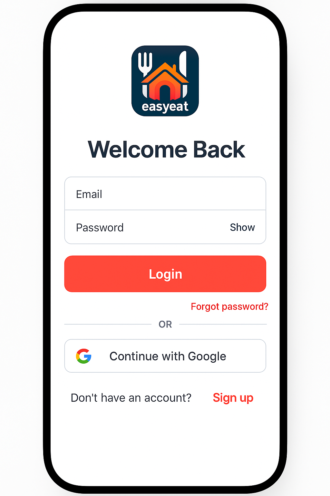

# Fresh Food Delivery App 🍴

A modern food delivery app built with **Expo** and **React Native**. Features a clean and intuitive UI with seamless navigation between screens, including a welcome page, login, and signup flows. Designed for scalability and a great user experience.

---

## Features ✨
- **Welcome Screen**: Engaging introduction with a "Get Started" button.
- **Login Screen**: Secure login with email and password fields.
- **Signup Screen**: Easy account creation with terms and conditions agreement.
- **Modern UI**: Clean design with **Google Fonts (Poppins)** and consistent styling.
- **Navigation**: Smooth transitions between screens using **Expo Router**.

---

## Tech Stack 🛠️
- **Frontend**: React Native, Expo
- **Navigation**: Expo Router
- **Styling**: React Native StyleSheet
- **Icons**: @expo/vector-icons
- **Fonts**: @expo-google-fonts/poppins

---
## FIGMA design

## FIGMA design




## Project Structure 📂
├── app/ # Main app screens and navigation
│ ├── welcomepage.tsx # Welcome screen
│ ├── login.tsx # Login screen
│ ├── signup.tsx # Signup screen
│ └── layout.tsx # Navigation layout
├── assets/ # Images, icons, and other static assets
├── components/ # Reusable UI components
├── constants/ # Constants like colors and themes
├── hooks/ # Custom React hooks
├── scripts/ # Utility scripts (e.g., reset-project)
├── package.json # Project dependencies
└── README.md # Project documentation


---

## Installation 📦
1. **Prerequisites**:
   - Install [Node.js](https://nodejs.org/) (v18 or higher recommended).
   - Install Expo CLI globally:
     ```bash
     npm install -g expo-cli
     ```

2. **Setup**:
   - Clone the repository:
     ```bash
     git clone https://github.com/mohammedsabri/EasyEat.git
     ```
   - Install dependencies:
     ```bash
     npm install
     ```

3. **Run the App**:
   - Start the development server:
     ```bash
     npx expo start
     ```
   - Scan the QR code with the **Expo Go** app on your device.

---

## Usage 📱
- **Welcome Screen**: Tap "Get Started" to navigate to the login screen.
- **Login Screen**: Enter your email and password to log in.
- **Signup Screen**: Create a new account with email, password, and terms agreement.

---

## Future Plans 📅
- Add menu browsing and food ordering functionality.
- Integrate payment gateway for seamless transactions.
- Implement user profile and order history screens.

---

## Contributing 🤝
Contributions are welcome! Please follow these steps:
1. Fork the repository.
2. Create a new branch for your feature or bug fix.
3. Submit a pull request with a detailed description of your changes.

---

## License 📄
This project is licensed under the **MIT License**. See the [LICENSE](LICENSE) file for details.